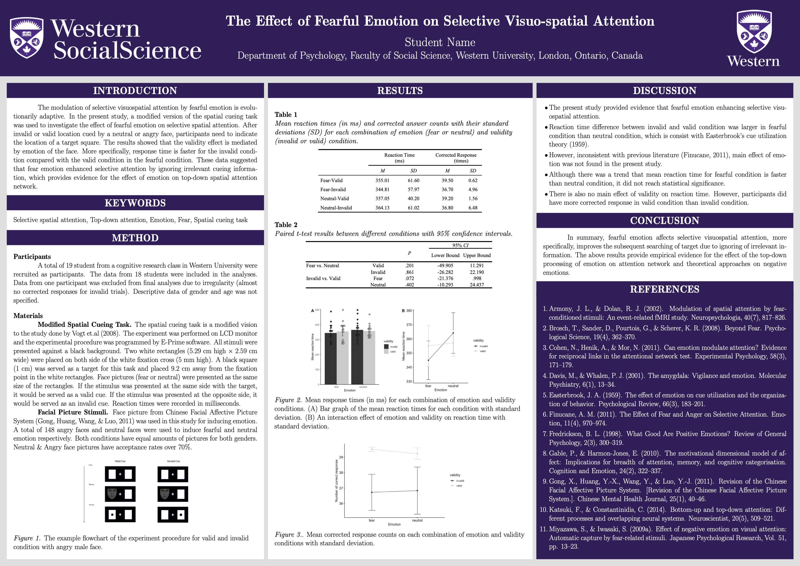

# UWO Poster LaTeX template

This template is based on the LaTeX package Tikzposter. There is a minor bug associate with this paticular package. The CPU usage will max out after finishing compiling. Please kill the pdftex process after compiling to avoid the situation. 

This template was created using *texmaker* under MacOS. If you are new to *LaTeX*, I highly recommend you try it. *LaTeX* will make your layout consistent, and it is very printer friendly. I recommend [
Michelle Krummel](https://www.youtube.com/channel/UCGCHc7LsEYT6_2dQauh2NYw)'s turtorial on *LaTeX* basic. It will benefit you for a life time. 

The example poster looks like this: 

